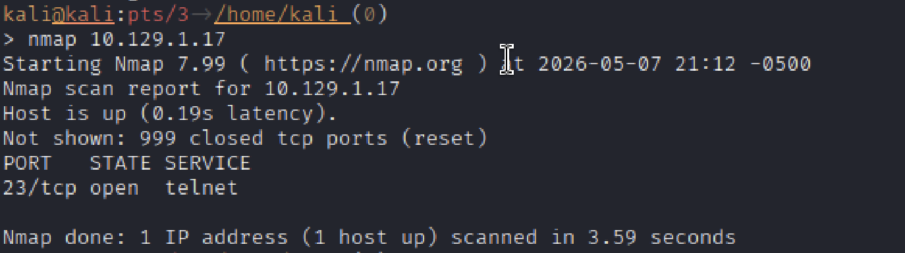
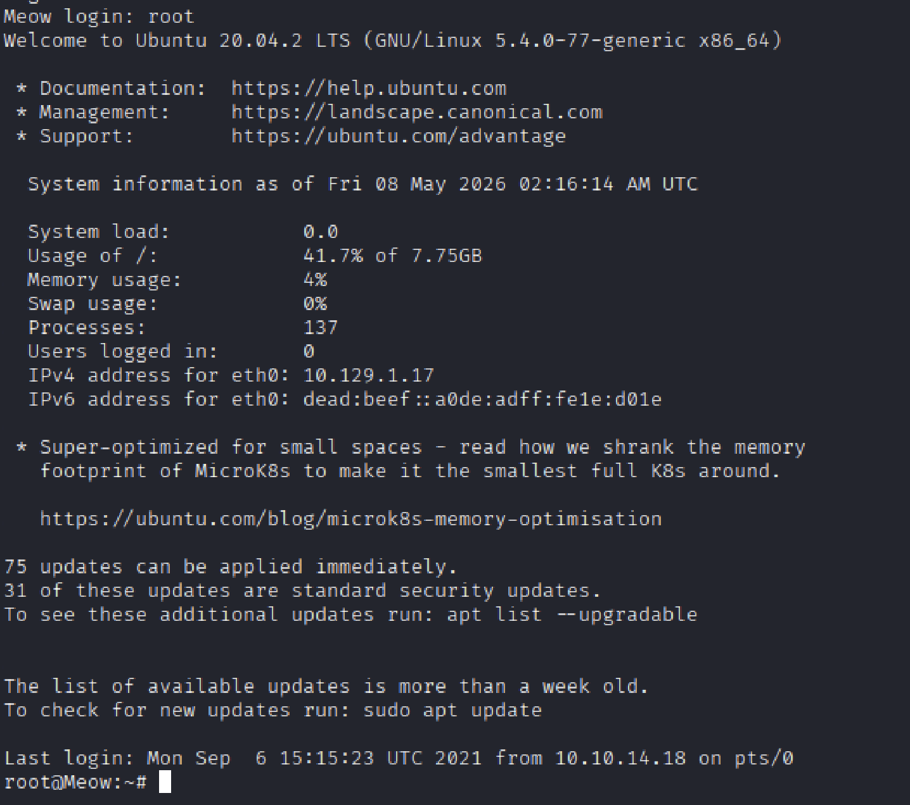
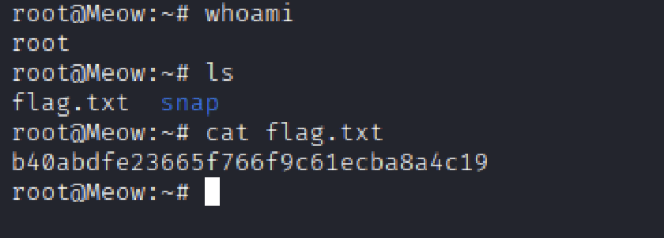

# Hack The Box — [Meow]

- Platform: Hack The Box
- Lab Type: Starting Point 
- Operating System: Linux 
- Difficulty: [Very Easy]
- Date Completed: [05/07/26]
- Author: Teal (Dalton Wright)

## Objective

- The objective of this machine is to practice simple enumeration using nmap and to explore the vulnerable nature of Telnet.

## Skills Demonstrated

- Network enumeration using Nmap

## Enumeration

- Nmap enumeration found the only open to be Telnet running on TCP port 23.

### Nmap Scan

Command Used:
nmap 10.129.1.17 (host IP)

## Exploitation

- Telnet is a vulnerable connection method that does not encrypt data transmission.
- Root access was not password protected

### Initial Access

- After establshing a telnet remote connection, access was achieved by entering the username "root" into the login prompt.

## Privilege Escalation

- Privelege escalation was unnecessary in this lab due to the user account accessed having root privelege.

# Flags Captured

- flag: b40abdfe23665f766f9c61ecba8a4c19

